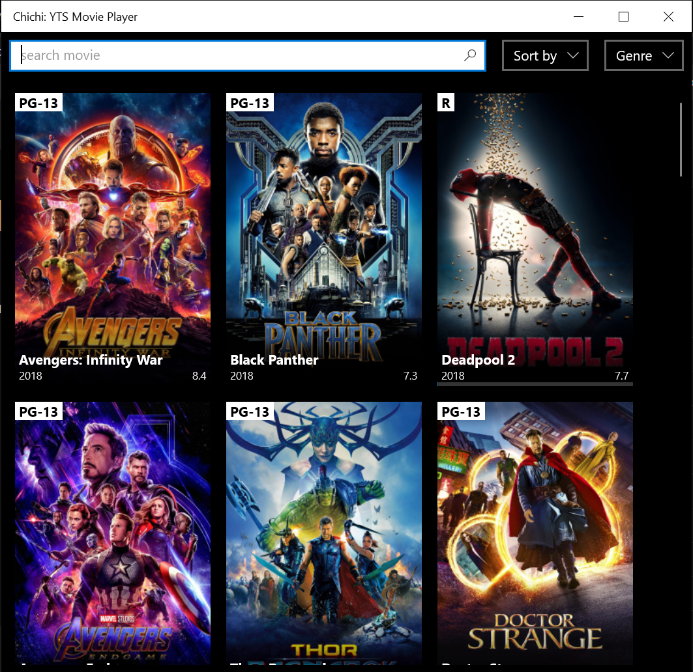
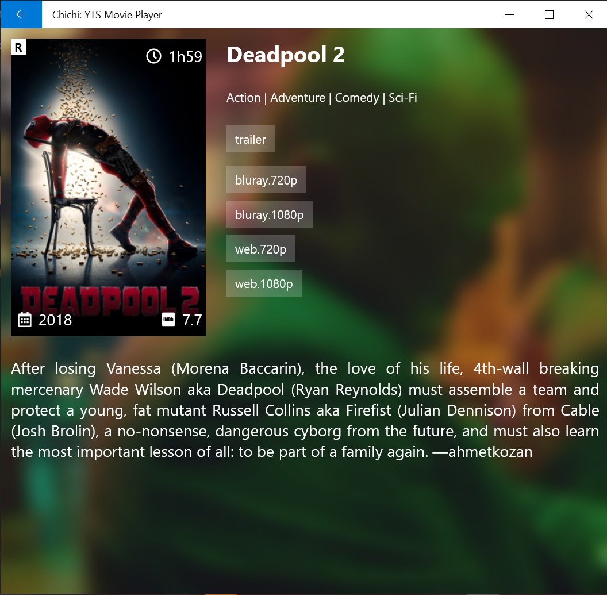
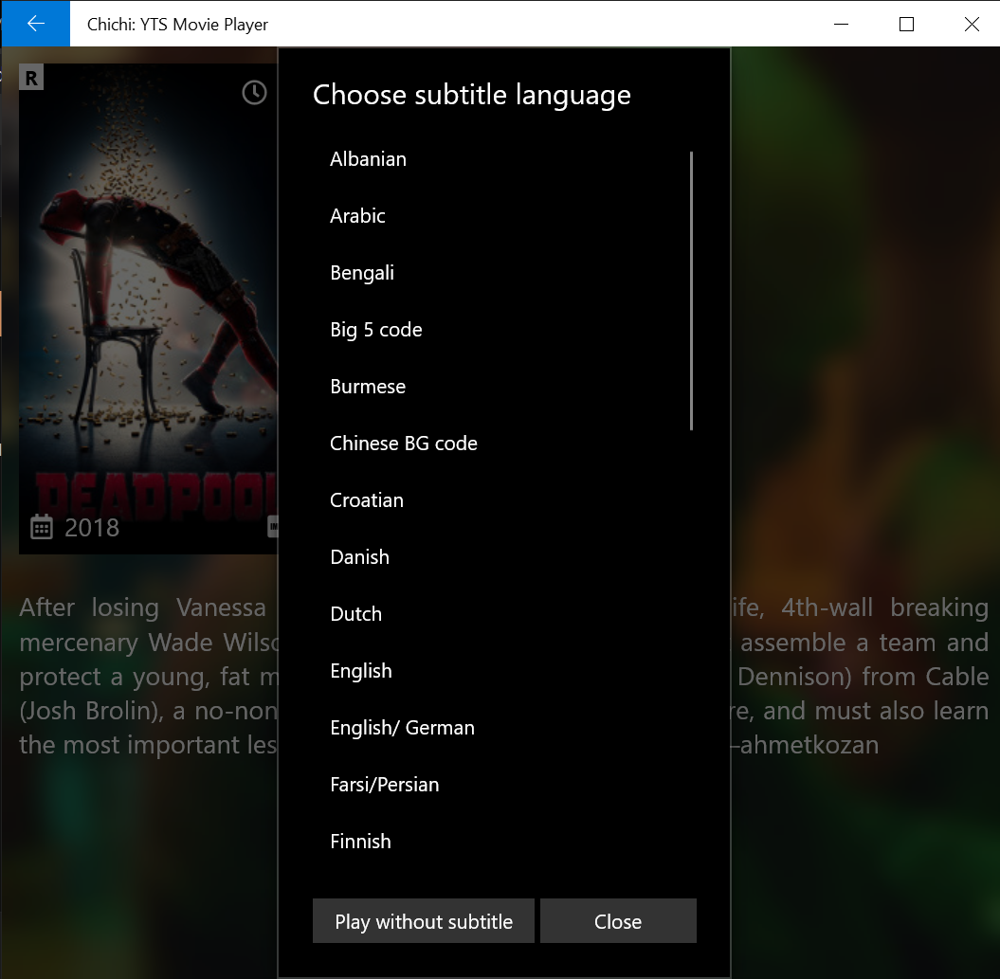
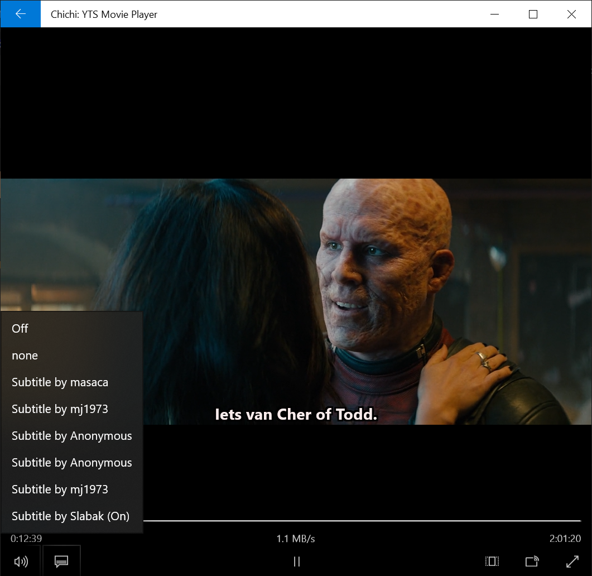

This is a UWP app to watch [YTS](https://yts.mx/) torrent movies directly.

It also automatically fetch subtitles from [subscene](https://subscene.com/).

# Screenshots

  
  
  
  

# Pre-built
Pre-built binary for anyone who wanna give it a try. Download [this zip](https://github.com/chichiyts/ChichiYTS/releases/download/v2020.7.24.0/ChichiYTS_2020.7.24.0.zip) file, extract, right-click on **Install.ps1** and choose **Run with PowerShell**, follow the instructions of Windows (if any) then enjoy 😄

## If you find this project helpful, how about shouting me a coffee or two 🤟

# Thanks
Many thanks to these awesome projects:
- https://yts.mx/
- https://subscene.com/
- https://github.com/arvidn/libtorrent
- https://github.com/SubtitleEdit/subtitleedit
- https://github.com/CharsetDetector/UTF-unknown
- https://github.com/JamesNK/Newtonsoft.Json
- https://github.com/psf/requests-html
- ...

# CAUTION
This project is for education purpose only, torrents may not legal in your country, use with your own risk.
